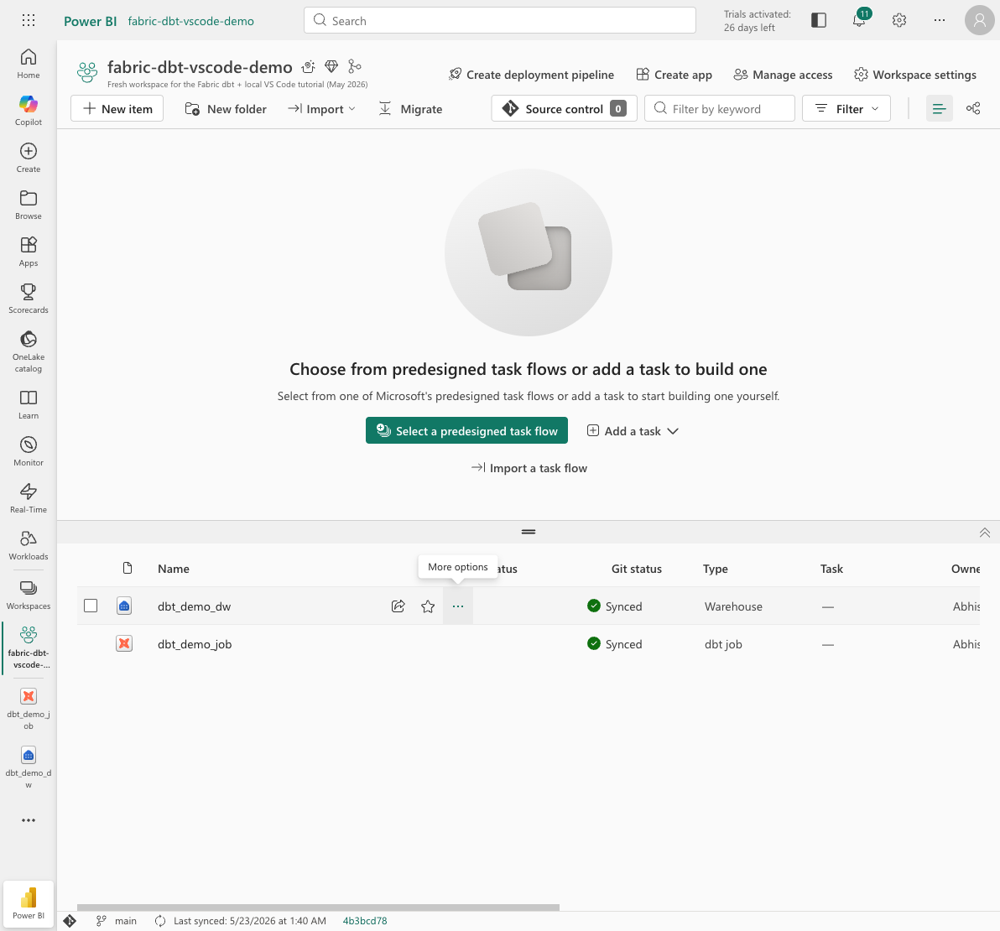
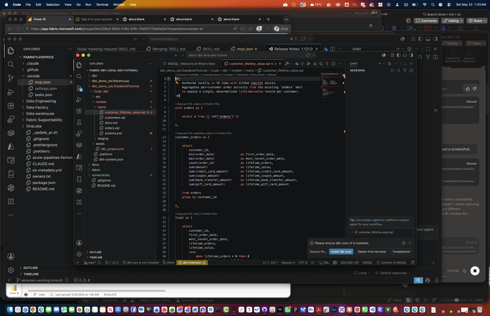
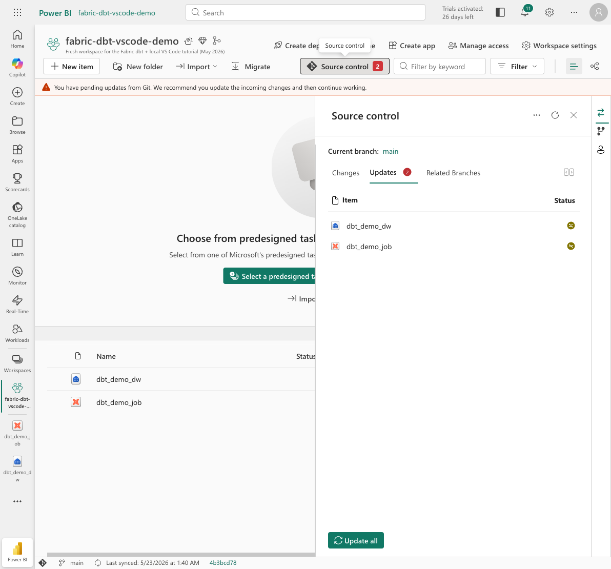
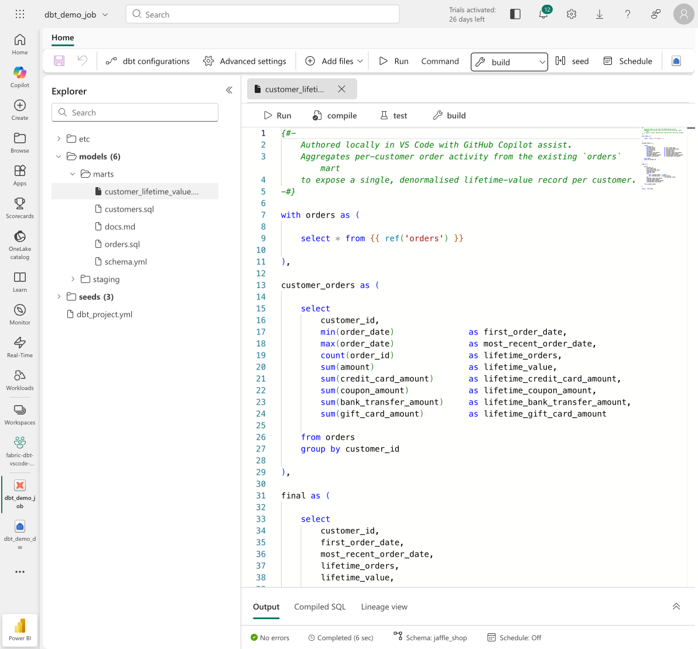
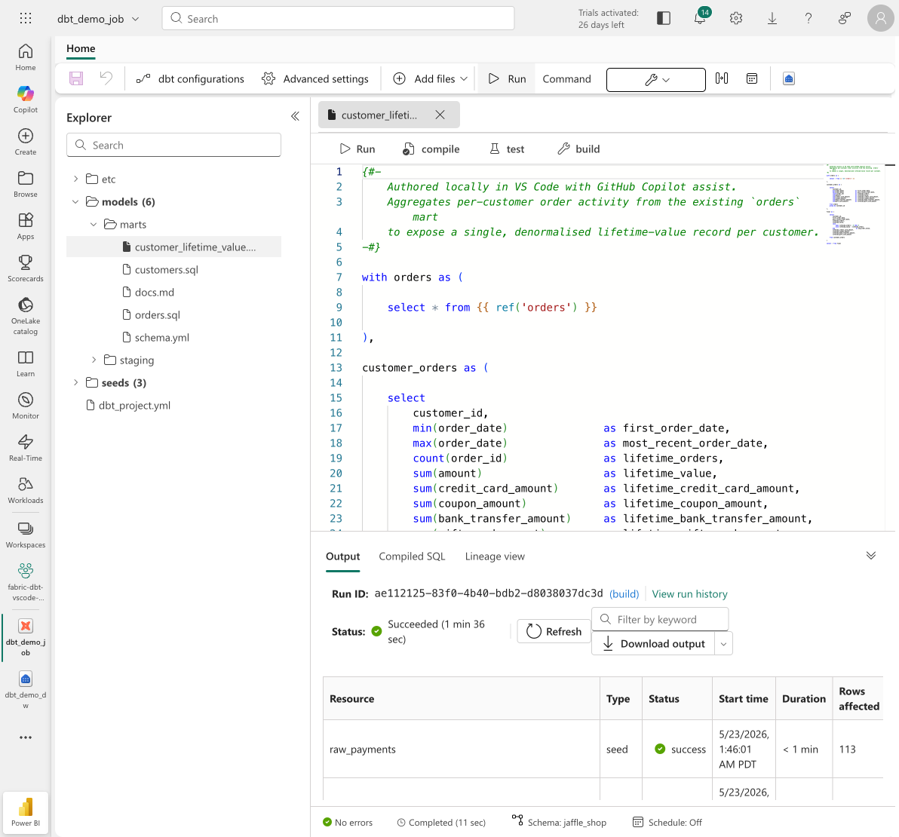

# Stop tab-switching to ship a dbt model: develop locally, operationalize in Microsoft Fabric

> **TL;DR** — Microsoft Fabric's dbt job lets you keep using the tools you already love (VS Code, GitHub Copilot, your own keybindings, your own terminal) while the warehouse, scheduling, and compute stay safely managed in Fabric. The repo is the contract; credentials never leave Fabric.

## The friction with browser-only data development

Fabric's in-browser dbt job UI is genuinely good — syntax highlighting, lineage, output, schedules, the works. But for anything beyond a quick edit, working entirely in a browser tab gets old fast:

- No GitHub Copilot in the editor (the one you've trained your fingers on).
- No `Cmd+P` to fuzzy-jump across hundreds of models.
- No `dbt parse` / `sqlfluff` / your own pre-commit hooks running on save.
- No git history at your fingertips, no `git blame` on a line, no stash, no rebase.
- No multi-cursor refactor across 40 staging files.

You *can* do all of this locally with the open-source dbt CLI — but then you've decoupled from Fabric's managed warehouse, secrets, and scheduling. The job that runs in production is now a different artifact than the code you author.

**Fabric's GitHub-integrated dbt job collapses that gap.** Your local clone and the Fabric job point at the same branch of the same repo. You author wherever you're most productive. Fabric runs the job with the credentials and compute it owns.

## What the round-trip actually looks like

I built a minimal end-to-end demo using the Jaffle Shop sample to prove the loop. The full step-by-step is in [`tutorial.md`](./tutorial.md) — this post is about *why* it matters.

### 1. Fabric scaffolds, GitHub stores

Create the workspace → create a Warehouse → create a dbt job seeded with the Jaffle Shop template → connect the workspace to GitHub from **Workspace settings → Git integration**. On Connect+sync, Fabric serializes the whole dbt project (and the warehouse) into the repo.



No credentials live in `profiles.yml` — Fabric injects the warehouse connection at runtime. The repo only contains the *project*, never secrets.

### 2. Clone and open in VS Code

```bash
git clone https://github.com/<you>/<repo>.git
cd <repo>
code .
```

Suddenly the same dbt project is in your editor of choice with full extension support — dbt Power User, sqlfluff, GitHub Copilot, GitLens, your linter, your formatter.

### 3. Author a model with Copilot

I asked Copilot to draft a `customer_lifetime_value` mart aggregating per-customer order activity from the existing `orders` mart. Two files: the `.sql` and an entry in `schema.yml` with `unique`, `not_null`, and `relationships` tests.



This is the part the browser UI simply cannot match — Copilot's context window, inline edit, follow-up refactors, and the ability to scan adjacent files for naming conventions in milliseconds.

### 4. Commit, push, watch Fabric notice

A normal `git commit && git push`. Back in Fabric's **Source control** panel, the new model appears under **Updates** with the modified items flagged.



Click **Update all** → Fabric pulls and rehydrates the workspace. The dbt job's Explorer tree now shows the new file.



### 5. Run in Fabric — managed compute, managed creds

Hit **Run** with the command set to `build`. Fabric executes seed → run → test against the Warehouse it provisioned. All six models build, `customer_lifetime_value` plus its five tests pass in under two minutes.



The dbt project moved through *four* environments — Fabric editor, GitHub, my laptop, Fabric runtime — without a single connection string leaving Fabric.

## Why this matters

| Pain in browser-only flow | What local + GitHub-backed Fabric gives you |
|---|---|
| No Copilot / no IDE features | Full VS Code + Copilot + extensions on the same files |
| Hard to refactor across many models | Project-wide fuzzy nav, multi-cursor, rename refactors |
| No pre-commit hooks | sqlfluff/dbt-checkpoint/your own hooks gate the push |
| Credentials risk if you go fully local | Fabric still owns the warehouse credential — never in repo |
| Drift between "what I edit" and "what runs" | Same git branch is the source of truth for both |
| No code review | GitHub PRs, required reviewers, branch protection apply |

## The security story in one paragraph

The dbt project in the repo references its target via dbt's standard `profile` mechanism. Locally you can run a *separate* `profiles.yml` (or `dbt parse` only) for offline work. In Fabric, the job uses a managed profile pointing at the workspace's Warehouse with credentials Fabric itself holds. **No PAT, no SQL password, no service principal secret ever enters the repository.** The GitHub PAT used for Git integration is stored in Fabric's secret store, not in the repo.

## Try it yourself

The companion [tutorial](./tutorial.md) walks through every click — fresh workspace, fresh warehouse, fresh dbt job, GitHub PAT, local clone, model authoring with Copilot, push, Fabric merge, run, output. Pair it with the [Jaffle Shop sample](https://github.com/dbt-labs/jaffle_shop) and you can reproduce this in about 20 minutes.

Local tools where they're strongest. Managed warehouse and scheduling where Fabric is strongest. Git as the contract between them. That's the workflow.
