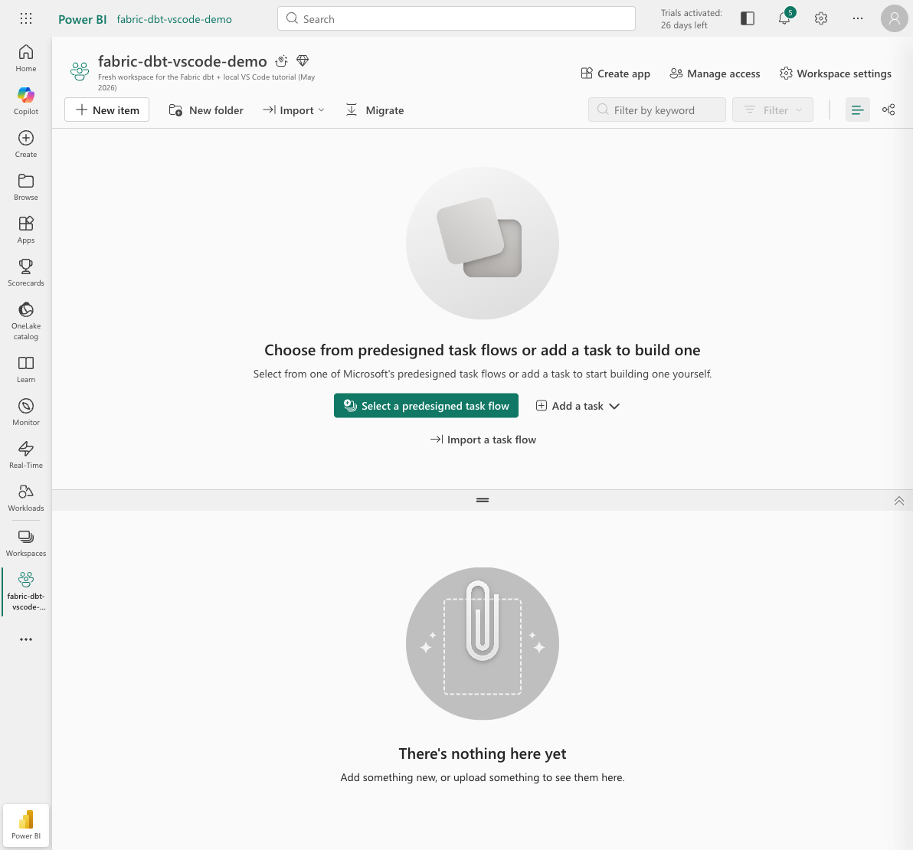
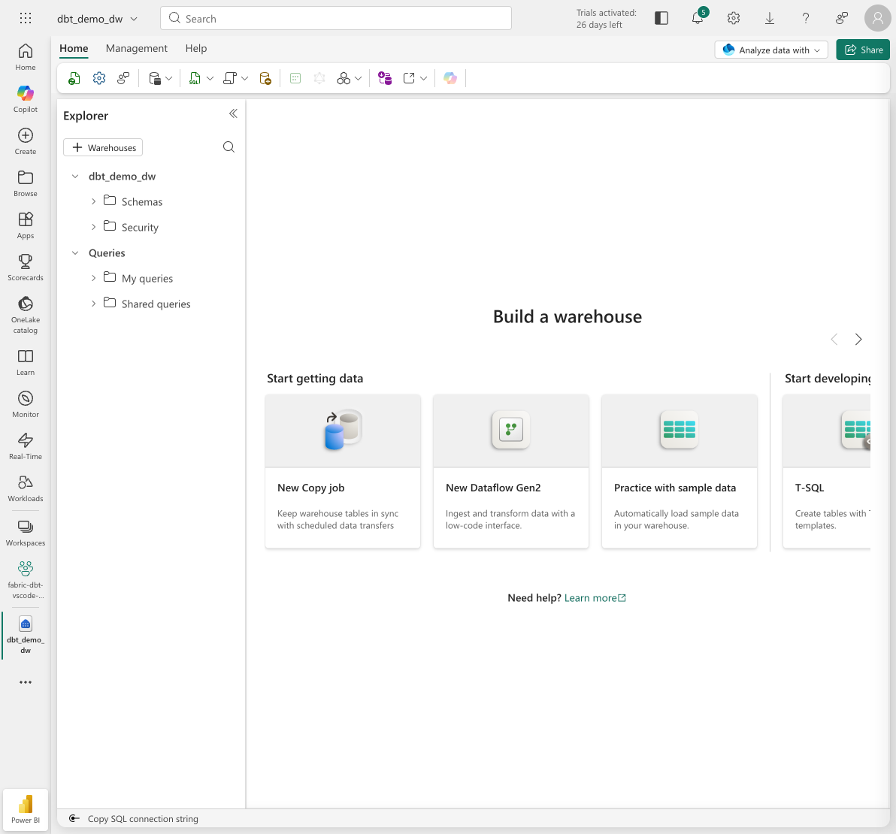
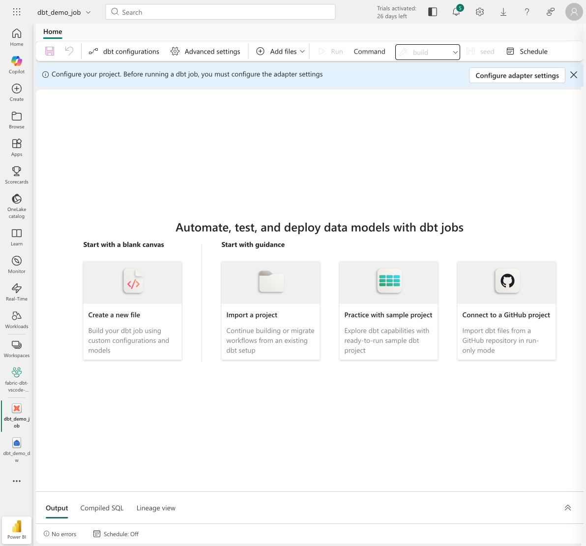
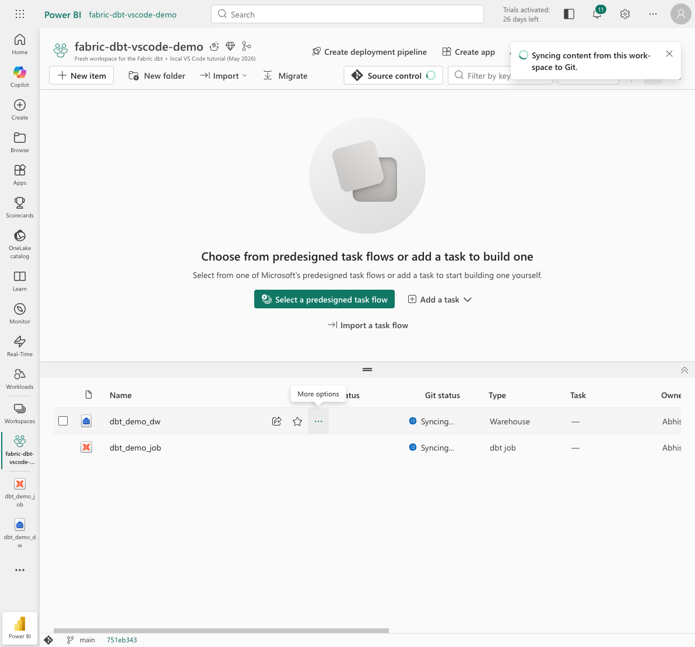

# Tutorial: Build a Fabric dbt job with GitHub + local VS Code development

This tutorial walks end-to-end through setting up a Microsoft Fabric workspace with a GitHub-backed dbt job, then editing dbt models locally in VS Code (with GitHub Copilot), pushing, and having Fabric detect and run the change. Every numbered screenshot in the [`screenshots/`](../screenshots/) folder maps to a step below.

## Prerequisites

- A Microsoft Fabric tenant with a workspace creation entitlement (Fabric trial or paid capacity).
- A GitHub account.
- A **GitHub Personal Access Token (Classic)** with `repo` scope — generate it at https://github.com/settings/tokens/new. Keep it on the clipboard; Fabric will prompt for it.
- VS Code installed locally with the GitHub Copilot extension signed in. (Optional but recommended: the **dbt Power User** extension.)
- `git` on your `PATH`.

## Step 0. Create (or pick) a GitHub repository

Create a new empty public or private repo on GitHub. For this tutorial:
- Name: `fabric-dbt-local-dev-tutorial`
- Initialize with a README (any content) — Fabric needs *some* commit to exist on `main` before it will connect.

If you're reusing an existing repo, make sure `main` is essentially empty (just README + `.gitignore`) so Fabric can scaffold cleanly without conflicting paths.

## Step 1. Create the Fabric workspace

1. Sign in to https://app.fabric.microsoft.com.
2. Left rail → **Workspaces** → **+ New workspace**.
3. Name: `fabric-dbt-vscode-demo`. Assign to your Fabric trial / capacity.
4. Click **Apply**.



## Step 2. Create a Warehouse (target for dbt)

1. Inside the new workspace, click **+ New item** → search **Warehouse** → click **Warehouse**.
2. Name it `dbt_demo_dw` and click **Create**.
3. Wait until the warehouse is provisioned and the SQL editor appears.



## Step 3. Create the dbt job

1. Back at the workspace, **+ New item** → search **dbt** → choose **dbt (preview) job**.
2. Name it `dbt_demo_job`. Click **Create**.
3. When asked for a starter project, pick the **Jaffle Shop sample**. Fabric scaffolds the standard dbt project (models/marts, staging, seeds, tests, `dbt_project.yml`).



4. The dbt editor opens with the Jaffle Shop tree on the left.


5. Configure the job's target warehouse: click **dbt configurations** in the toolbar → set the target to `dbt_demo_dw` you created in Step 2 → **Save**.

## Step 4. Connect the workspace to GitHub

> **Important:** Use the **Workspace settings** button in the workspace header, **not** the legacy `?tab=GitIntegration` URL — that loads the old Power BI settings page.

1. Workspace header → **Workspace settings** (gear icon).
2. Left nav → **Git integration**.
3. **Git provider:** GitHub.
4. **Connect your account:** if it's your first time, Fabric opens a popup asking for a **GitHub Personal Access Token**. Paste your PAT, give the connection a display name, click **Connect**.
5. Choose:
   - **Organization / owner:** your GitHub username (or org).
   - **Repository:** `fabric-dbt-local-dev-tutorial`.
   - **Branch:** `main`.
   - **Folder:** `/` (repository root).
6. Click **Connect and sync**.

Fabric serializes `dbt_demo_job` and `dbt_demo_dw` into the repo (item-name-suffixed folders, e.g. `dbt_demo_job.DataBuildToolJob/`).




## Step 5. Clone the repo locally and open in VS Code

```bash
git clone https://github.com/<your-username>/fabric-dbt-local-dev-tutorial.git
cd fabric-dbt-local-dev-tutorial
git pull origin main      # ensure you have Fabric's initial scaffolding
code .                    # or: open -a "Visual Studio Code" .
```

You should see this layout:

```
dbt_demo_job.DataBuildToolJob/
  Code/dbt/
    dbt_project.yml
    models/
      marts/
        customers.sql
        orders.sql
        schema.yml
      staging/...
    seeds/...
dbt_demo_dw.Warehouse/
  ...
README.md
```

## Step 6. Author a new model with GitHub Copilot

We'll add a `customer_lifetime_value` mart that aggregates per-customer order activity.

1. In VS Code, create `dbt_demo_job.DataBuildToolJob/Code/dbt/models/marts/customer_lifetime_value.sql`.
2. Open Copilot Chat (or use inline Copilot) and ask:
   > *"Create a dbt mart model that aggregates per-customer order activity from the existing `orders` mart. Include first/last order date, lifetime order count, lifetime spend, totals by payment method, and average order value. Use the existing ref('orders')."*
3. Accept Copilot's suggestion. The result should look something like:

   ```sql
   {#-
     Authored locally in VS Code with GitHub Copilot assist.
     Aggregates per-customer order activity from the existing `orders` mart
     to expose a single, denormalised lifetime-value record per customer.
   -#}

   with orders as (
     select * from {{ ref('orders') }}
   ),
   customer_orders as (
     select
       customer_id,
       min(order_date) as first_order_date,
       max(order_date) as most_recent_order_date,
       count(order_id) as lifetime_orders,
       sum(amount) as lifetime_value,
       sum(credit_card_amount) as lifetime_credit_card_amount,
       sum(coupon_amount) as lifetime_coupon_amount,
       sum(bank_transfer_amount) as lifetime_bank_transfer_amount,
       sum(gift_card_amount) as lifetime_gift_card_amount
     from orders
     group by customer_id
   ),
   final as (
     select
       *,
       case when lifetime_orders > 0 then lifetime_value / lifetime_orders else 0 end as avg_order_value
     from customer_orders
   )
   select * from final
   ```

4. Open `models/marts/schema.yml` and append a matching entry with tests:

   ```yaml
     - name: customer_lifetime_value
       description: Per-customer lifetime order metrics derived from the orders mart.
       columns:
         - name: customer_id
           tests:
             - unique
             - not_null
             - relationships:
                 to: ref('customers')
                 field: customer_id
         - name: lifetime_orders
           tests: [not_null]
         - name: lifetime_value
           tests: [not_null]
   ```


## Step 7. Commit and push

```bash
git add dbt_demo_job.DataBuildToolJob/Code/dbt/models/marts/customer_lifetime_value.sql \
        dbt_demo_job.DataBuildToolJob/Code/dbt/models/marts/schema.yml
git commit -m "Add customer_lifetime_value mart with tests"
git push origin main
```

> *A `credential-manager` warning at the end of `git push` is benign on macOS — the push still succeeds via cached HTTPS creds.*

## Step 8. Have Fabric detect and merge the change

1. Back in Fabric, open your workspace.
2. In the workspace header, click **Source control**.
3. Open the **Updates** tab. You should see `dbt_demo_job` (and possibly `dbt_demo_dw` as part of any reserialization) listed as **Modified**.


4. Click **Update all**. Fabric pulls the new commit and rehydrates the workspace items. Wait until the status returns to **Synced** (~20–30s).

## Step 9. Verify in the dbt job UI

1. Open `dbt_demo_job` from the workspace.
2. In the Explorer tree on the left, expand `models/marts`. You should now see `customer_lifetime_value.sql` alongside `customers.sql` and `orders.sql`.
3. Click it — the content matches what you authored locally.


## Step 10. Run the job

1. In the top toolbar, ensure the **Command** dropdown is set to `build` (this runs seed → run → test in one shot).
2. Click **Run**.
3. The Output tab streams a `Queued` → `In progress` → `Succeeded` status. With Jaffle Shop + our new mart, the run completes in ~1m 30s.
4. Confirm in the result grid:
   - All seeds: `success`.
   - `customer_lifetime_value` model: `success`.
   - Five new tests (`unique`, `not_null × 3`, `relationships`) on `customer_lifetime_value`: `pass`.


## You're done

You now have a Fabric workspace where:
- The dbt project lives in GitHub and is the single source of truth.
- You can develop locally in VS Code with Copilot and all your usual extensions.
- Fabric automatically detects pushed changes and runs them against a managed Warehouse.
- No credentials live in the repo — the warehouse profile is injected by Fabric at runtime, and your GitHub PAT is held in Fabric's secret store.

## Troubleshooting

| Symptom | Fix |
|---|---|
| Workspace **Settings** page looks like old Power BI and has no Git integration option | Use the **Workspace settings** button in the workspace header, not the `?tab=GitIntegration` URL. |
| `git push` fails with a credential prompt | Configure `git config --global credential.helper osxkeychain` (macOS) and retry. |
| Fabric **Update all** flips a *different* item to **Uncommitted** | Benign serialization churn (Fabric rewrites some metadata fields). Commit it back from the **Changes** tab if you want a fully clean state. |
| dbt `build` fails on the new model with `Compilation Error - depends on ref('orders')` | Make sure the existing `orders.sql` mart wasn't accidentally deleted. The new model `ref`s it. |
| Edge / browser won't launch a fresh session | Quit the browser fully (`Cmd+Q` on macOS) before re-opening Fabric. |

## What to try next

- Open a **pull request** instead of pushing to `main`. Use a feature branch in Fabric's Git integration (Workspace settings → Git integration → switch branch) so each contributor gets isolated changes.
- Add a **sqlfluff** pre-commit hook locally so style is enforced before Fabric ever sees the code.
- Schedule the dbt job in Fabric (`Schedule` button in the top toolbar) so the model refreshes on a cadence.
- Build a **lineage view** in the dbt job UI to visualize the new node and its tests in context.
